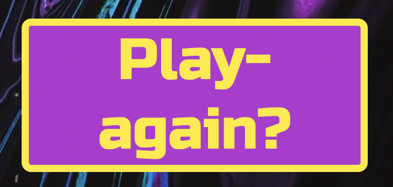

# Rock Paper Scissors

Play the classic game rock scissors and paper. A wellknown game, played all over the world. 
This website was designed and developed as a game that can be enjoyed by people of all ages. You play against the computer, the goal is to get the highest score after 10 moves.

[Live link to the Website](https://malinpalo.github.io/Rock-Scissors-Paper/)

# Table of Contents
1. [User experience](#id-User-experience)
2. [Features](#id-features)
    * [Header and Title](#id-header)
    * [Scores](#id-scores)
    * [Game area](#id-game-area)
    * [Game](#id-game)
    * [Winner text for each round](#id-winner)
    * [Losing text for each round](#id-loser)
    * [Winning text](#id-win)
    * [Losing text](#id-lose)
    * [Restart button](#id-restart)
3. [Design](#id-design)
4. [Technologies used](#id-tech)
5. [Testing](#id-testing) 
6. [Validator Testing](#id-validator)
7. [Bugs](#id-bugs)
8. [Unfixed Bugs](#id-unfixed)
9. [Deployment](#id-deploy)
10. [Credits](#id-credits)
11. [Acknowledgements](#id-acknowledgements)

# User experience

## User Stories

* As a User

  * As a user, I want a website that is easy to understand.
  * As a user, I want to see a game that will be responsive to play on different media screens.
  * As a user, I want to see an interactive game that will show who wins.
  * As a user, I want to see who wins each game round.
  * As a user, I want to easily see how I can restart the game.

* As a returning user 

  * As a returning user, I want the website to be continually updated with new features that keeps me coming back to play the game over and over again.

# Features

* ### The Header and Title

When the user opens the webpage, the website color is the first thing that will catch their attention. It's colorful and feels like a fun game! The headline that says "Let's play" hopefully makes the player feel welcome and can't wait to face the computer in an exciting match.

* ### Scores

This area is where the computer and users scores are displayed. To win the game it's about getting the highest score after 10 moves.

* ### Game area

The game area is the area where you see the entire game. There is a text to show where you pick your move to easily see how you start playing. It also shows how many moves that are left before the round ends. After each choise you make, a text is shown how each move went and after 10 rounds you see who wins the game. When the game is finished a text shows who won and a restart button appears to easily play the game again.

* ### Game
 
The game is where the player challenges the computer. There are three choices for both to make, rock, paper or scissors. The player starts to choose, then it's the computer's turn, which is completely random. Below the buttons it's shown who is beating the other in each round while the score increases for each participant after each move.

* ### Winner text for each round

* ### Losing text for each round

* ### Winning Text

The user who defeats the computer is notified by a text that they have won the game. This is when the game is over after ten rounds and the user can restart the game again. This is good for the user, as they are informed that the game is over and will not continue.

* ### Losing Text

When the computer wins the users are notified with a text that they have lost the game. This is when the game is over after ten rounds and the user can restart the game again. This is good for the user, as they are informed that they have lost and the game will not continue.

* ### Restart button

When the game is over, a button appears where the player can choose to restart the game. The game is restarted when the button is clicked and the score and remaining moves are reset.

* ### Features left to implement
 I would like to implement a featue what the player's as well as the computer's choice of rock, paper or scissors are, not just who wins. I also would work on my media queries to get the game to look better on bigger screens.

# Design

* ### Colours
I used linear-gradient from blue to red to get the to get viewers' attention. I been trying to get good visibility using the contrast of the different colors so that the visually impaired can easily see everything that is written.
I have also tried to make my page look happy by mixing the colors from my palette in a tasteful way.
   
* ### Colour Palette

* ### Wireframes
Wireframes were created for mobile and desktop.
To get an overview of how the page will look when it is finished.
 

* ### Media
  * The images used in the website were taken from:
  [Pexels](https://www.pexels.com/) 
  [Vecteezy](https://www.vecteezy.com/anonymous/610fa46a-ea0a-4dfb-b5b8-cc753e2d4eb1/collections/224565/my-first-collection)

* ### Typography

  * The font chosen was Russo One for the whole page. Sans-serif where used for backup.
  

# Technologies Used

 * HTML5
 * CSS3 
 * javaScript
 * Gitpod 
 * GitHub 
 * Google Fonts
 * Chrome dev tools

# Testing

* ### Validator Testing

  * Html
    *  There were no errors found when I tested the webpage on the HTML validator.   
    

        
  * CSS
    *  There were no errors found when I tested the webpage on the CSS validator.
      

  * javaScript
    *  No errors where found when I tested the webpage on jshint. 

* ### Am I Responsive
  * To test my website on all iphone devices I used [am I responsive](https://ui.dev/amiresponsive?url=https://8000-malinpalo-rockscissorsp-ghb9wsgbskv.ws-eu77.gitpod.io/)

* ### Responsive designchecker

  * I used the Responsive designchecker to check for the responiveness on a variety of screen sizes. All elements maintained functionality.
  * Notebook from 10* - 15* maintained functionally and a good visability. 
  * Apple Iphone 3/4/4s/5 and 5s maintained functionally and a good visability.
  * Apple Ipone 6/6s and 7 and maintained functionally and a good visability.
  * Samsung Galaxy S5/S6/S7 maintained functionally and a good visability.
  * Sony Xperia Z2/Z3 maintained functionally and a good visability.

* ### Lighthouse
    *  I tested he website on the Lighthouse testing in the chrome dev tools, the results are shown below.  
    

# Bugs

   * I could not get the text for what the computer chose running so I removed the function.
* ### Unfixed Bugs

   * I tried to add a favicon several times, but I couldn't get it right so I didn't use It.
   

# Deployment

The site was deployed to GitHub pages. The steps to deploy are as follow:
* In the Github repository, go to settings tab.
* Navigate to Pages.
* Under Source, select the branch to 'main', then click save.
* The page will automatically be refreched and the link to your page appears to indicate the successful deployment!

 

# Credits

  * When coding the project I used several tutorials on youtube for inspiration.
  * I took inspitation from [YouTube channel](https://www.youtube.com/watch?v=RwFeg0cEZvQ) 
  * An also from this video [YouTube channel](https://www.youtube.com/watch?v=1yS-JV4fWqY&t=429s) 
  * An also from this video [YouTube channel](https://www.youtube.com/watch?v=qWPtKtYEsN4&t=920s)   

# Acknowledgments

   * The tutors from Code Institute and the slack community for help and and advice.
   * Code Institite course material.
    
