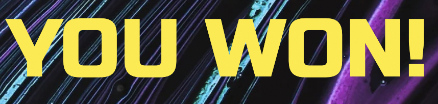
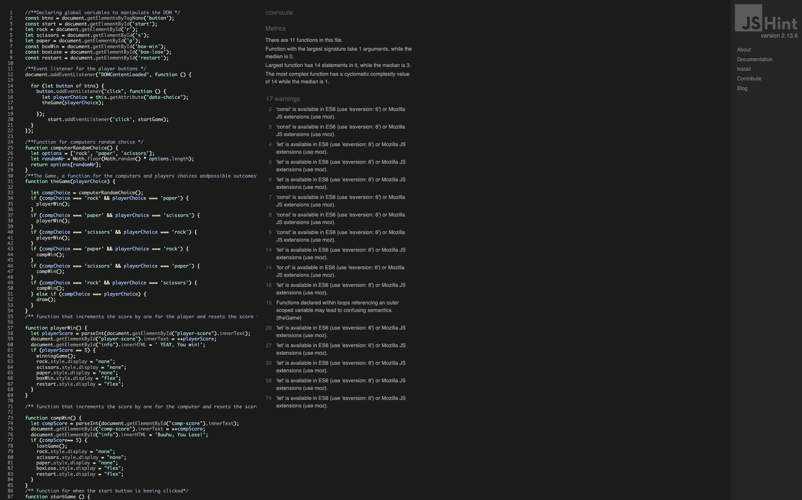

# Rock Paper Scissors

Play a well known game, rock, paper,scissor. A game played all over the world. 
This website was designed and developed as a game that can be enjoyed by players in all ages. The player plays against the computer, highest score after 5 rounds wins.

[Live link to the Website](https://malinpalo.github.io/Rock-Scissors-Paper/)

# Table of Contents
1. [User experience](#id-User-experience)
2. [Features](#id-features)
    * [The welcome page](#id=-welcome)
    * [Header and Title](#id-header)
    * [Scoreboard](#id-scores)
    * [Game area](#id-game-area)
    * [Game](#id-game)
    * [Winner text for each round](#id-winner)
    * [Losing text for each round](#id-loser)
    * [Winning text](#id-win)
    * [Losing text](#id-lose)
    * [Restart button](#id-restart)
3. [Design](#id-design)
4. [Technologies used](#id-tech)
5. [Testing](#id-testing) 
6. [Validator Testing](#id-validator)
7. [Bugs](#id-bugs)
8. [Unfixed Bugs](#id-unfixed)
9. [Deployment](#id-deploy)
10. [Credits](#id-credits)
11. [Acknowledgements](#id-acknowledgements)

# User experience

## User Stories

* As a User

  * As a user, I want a website that is easy to understand.
  * As a user, I want to see a game that will be responsive to play on different media screens.
  * As a user, I want to see an interactive game that will show who wins.
  * As a user, I want to see who wins each game round.
  * As a user, I want to easily see how I can restart the game.

* As a returning user 

  * As a returning user, I want the website to be continually updated with new features that keeps me coming back to play the game over and over again.

# Features

* ### The welcome page 

When the user opens the webpage, the user encounters an colorful welcome box with rules of how to play the game. The welcome page with it's bright colors appears like a cool and fun, eye catching page that makes the player wanna try the game. 

* ### The Header and Title

The header is in a bright yellow color that stands out from the rest of the game so that the player doesn't forget what they are playing.

* ### Scoreboard

The scoreboard is where the computer and users scores are displayed. The goal is to get the hightest score in 5 moves.

* ### Game area

The game area is the area where you see the entire game. There is a text reminding the player to chose a hand. After each choise the user make a text is shown with the information on who won or lost.
When the game is finished the buttons dissapeare, a text appares with information of if the user won or lost and a restart button appears to offer the user another round.

* ### Game
 
The game is where the user challenges the computer. There are three choices for both to make, rock, paper or scissors. The user choose first by clicking one of the buttons made out of icons, then it's the computer's turn. The computers choice is completely random. Below the buttons a test is shown informing the user if they won or lost. The score increases for each participant after each move.

* ### Winner text for each round

The text that appeares under the buttons after each round if the user wins.

* ### Losing text for each round

The text that appeares under the buttons after each round if the user lose.

* ### Winning Text

If the user defeats the computer the user gets notified by a text that says that they have won the game. The buttons dissapeare, the text appeares together with a reset button wich gives the user a clear notification that the game is over.

* ### Losing Text

If the user defeats the computer the user gets notified by a text that says that they have won the game. The buttons dissapeare, the text appeares together with a reset button wich gives the user a clear notification that the game is over.

* ### Restart button

When the game is over a bright colorful restart button appeares with a text asking the player to Play again? The button is clicked the game restarts. The score resets and the buttons appeares. The restart button is design with the intention to make the user wanna push the button to play again. The design is playful.

* ### Features left to implement
 I would like to implement:
  * a text saying what the user as well as the computer chose.
  * music that plays during the game.
  * a countdown for moves left.

# Design

* ### Colours
I've been trying to get good visibility using the contrast of the different colors so that the visually impaired can easily see everything that is written.
I've been trying to make the websight look a bit like taken from the 80's game world with bright colors. The background is in different colors, blue, purple, black to stand in contrast with the chosen colors.
   
* ### Colour Palette

* ### Wireframes
I created wireframes for mobile and desktop.
To get an overview of how the page will look when it is finished.
 

* ### Media
  * The images used in the website were taken from:
  [Pexels](https://www.pexels.com/) 
  [Vecteezy](https://www.vecteezy.com/anonymous/610fa46a-ea0a-4dfb-b5b8-cc753e2d4eb1/collections/224565/my-first-collection)

* ### Typography

  * The font chosen was Russo One for the whole page. Sans-serif where used for backup.
  

# Technologies Used

 * HTML5
 * CSS3 
 * javaScript
 * Gitpod 
 * GitHub 
 * Google Fonts
 * Chrome dev tools

# Testing

* ### Validator Testing

  * Html
    *  There were no errors found when I tested the webpage on the HTML validator.   
    

        
  * CSS
    *  There were no errors found when I tested the webpage on the CSS validator.
      

  * javaScript
    *  No errors where found when I tested the webpage on jshint. 
    

* ### Am I Responsive
  * To test my website on all iphone devices I used [am I responsive](https://ui.dev/amiresponsive?url=https://8000-malinpalo-rockscissorsp-ghb9wsgbskv.ws-eu77.gitpod.io/)

* ### Responsive designchecker

  * I used the Responsive designchecker to check for the responiveness on a variety of screen sizes. All elements maintained functionality.
  * Notebook from 10* - 15* maintained functionally and a good visability. 
  * Apple Iphone 3/4/4s/5 and 5s maintained functionally and a good visability.
  * Apple Ipone 6/6s and 7 and maintained functionally and a good visability.
  * Samsung Galaxy S5/S6/S7 maintained functionally and a good visability.
  * Sony Xperia Z2/Z3 maintained functionally and a good visability.

* ### Lighthouse
    *  I tested he website on the Lighthouse testing in the chrome dev tools, the results are shown below.  
    

# Bugs

* ### Fixed Bugs 
   * I could not get the text for what the computer chose running so I removed the function.
   * Console error became present preventing execution of script code after the last tidy up, before deployment, where I removed some html code. I've solved that error by reinserting the code.

* ### Unfixed Bugs

   * I tried to add a favicon several times, but I couldn't get it right so I didn't use It.
   

# Deployment

The site was deployed to GitHub pages. The steps to deploy are as follow:
* In the Github repository, go to settings tab.
* Navigate to Pages.
* Under Source, select the branch to 'main', then click save.
* The page will automatically be refreched and the link to your page appears to indicate the successful deployment!

 

# Credits

  * When coding the project I used several tutorials on youtube for inspiration.
  * I took inspitation from [YouTube channel](https://www.youtube.com/watch?v=RwFeg0cEZvQ) 
  * An also from this video [YouTube channel](https://www.youtube.com/watch?v=1yS-JV4fWqY&t=429s) 
  * An also from this video [YouTube channel](https://www.youtube.com/watch?v=qWPtKtYEsN4&t=920s)   

# Acknowledgments

   * The tutors from Code Institute and the slack community for help and and advice.
   * Code Institite course material.
    
